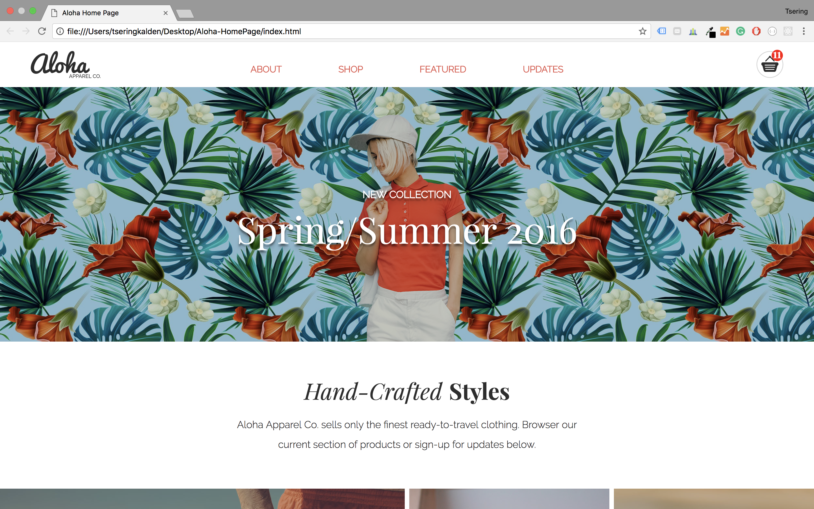

# Project: Aloha Apparel Co.
The purpose of this project is to build a responsive website for Aloha Apparel Co. using HTML and CSS components.

## Desktop

## Tablet

## Mobile

# Technologies Used
* Visual Studio Code (https://code.visualstudio.com/download) 
* Git Bash (https://git-for-windows.github.io/)
* Google Chrome (https://www.google.com/chrome/)
* Google Chrome Developer Tools
* Fontface Ninja (Google Chrome extension)
* Page Ruler (Google Chrome extension)
* Eye Dropper (Google Chrome extension)
* HTML Validator (https://validator.w3.org/nu/#file)
* CSS Validator (https://jigsaw.w3.org/css-validator/#validate_by_upload)
* Autoprefixer (https://autoprefixer.github.io/)
* Font Squirrel (https://www.fontsquirrel.com/)
* Font Awesome (http://fontawesome.io/)
* JavaScript
* JQuery (https://jquery.com/)
* JQuery Plugins (Flickity: http://flickity.metafizzy.co/)
* Smooth Scrolling (https://css-tricks.com/snippets/jquery/smooth-scrolling/)
* Grid Css (https://css-tricks.com/snippets/css/complete-guide-grid/)
* Flexbox (https://css-tricks.com/snippets/css/a-guide-to-flexbox/)
